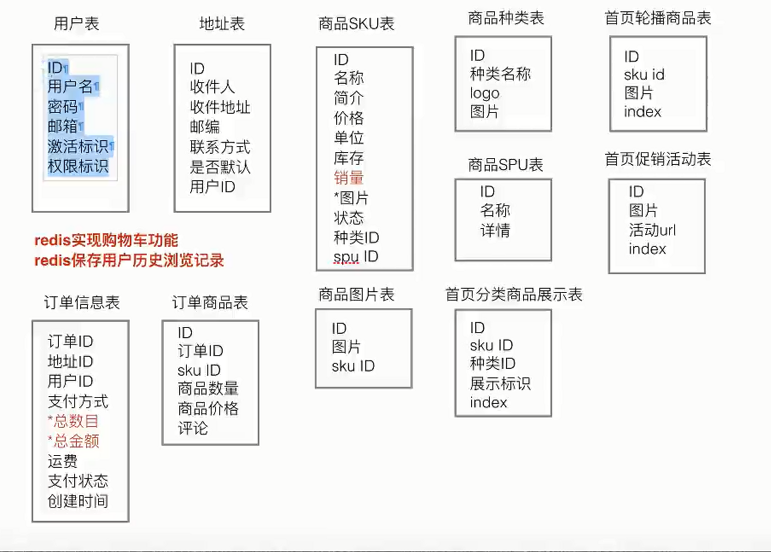

[](https://github.com/Pad0y)
[](https://github.com/Pad0y)
[](https://blog.csdn.net/qq_34356800)
[](https://www.travis-ci.org/Pad0y/Django2_dailyfresh)

---
# 天天生鲜-django2.2版本

## 简介
**本项目替换原项目框架django1.8为最新版的django2.2.5**，该项目包含了实际开发中的电商项目中大部分的功能开发和知识点实践，
是一个非常不错的django学习项目，同时也记录在替换框架中遇到的坑，所遇到的django1.x和2.x的区别，希望对各位有所帮助。

关键词：django2 celery fdfs haystack whoosh redis nginx 高并发 分布式

# 技术栈
```text
celery：分别负责用户注册异步发送邮件以及不用用户登陆系统动态生成首页
fdfs+nginx：存储网站静态文件，实现项目和资源分离，达到分布式效果
haystack+whoosh+jieba：全文检索框架，修改底层haystack库使之对中文搜索更加友好
redis：作为django缓存和session存储后端，提升网站性能，给予用户更好体验
```
## 开发环境  
```text
python:3.6.5
django:2.2.5
pycharm:2019.2
OS: win10
```
## 功能模块
- [x] 用户模块
    - [x] 注册
    - [x] 登录
    - [x] 激活(celery)
    - [x] 退出
    - [x] 个人中心
    - [x] 地址管理
- [x] 商品模块
    - [x] 首页(celery)
    - [x] 商品详情
    - [x] 商品列表
    - [x] 搜索功能(haystack+whoosh)
- [x] 购物车模块(redis)
    - [x] 增加
    - [x] 删除
    - [x] 修改
    - [x] 查询
- [x] 订单模块
    - [x] 确认订单页面
    - [x] 订单创建
    - [x] 请求支付(支付宝)
    - [x] 查询支付结果
    - [x] 评论
 

## 项目架构图


## 数据库表分析图


# 环境配置
- [FDFS配合Nginx的安装](documents/FastDFS-description.md)
- [python3与fdfs交互踩坑记录](documents/py3fdfs.md)
- [windows上celery4.x不兼容问题完美解决办法](documents/celery_on_win10.md)
- [jieba分词设置修改](documents/jieba.md)
- [支付宝sdk接入](https://github.com/fzlee/alipay/blob/master/README.zh-hans.md)
# 项目部署（开发环境）
- 依赖库安装
```text
pip install -U pip
pip install -r requirements.txt
```
- mysql数据库创建
```mysql
CREATE DATABASE `dailyfresh` CHARACTER SET 'utf8';
```
- 启动项目所需服务(win10)
```shell script
# windows redis的启动，配置文件在redis安装目录下
$ redis-server redis.windows.conf

# 启动celery, 进入项目虚拟环境，在项目根目录下执行
$ celery -A celery_tasks.tasks worker --loglevel=info -P eventlet
```

# 启动FastDFS服务, 启动nginx
```shell script
$ /usr/bin/fdfs_trackerd /etc/fdfs/tracker.conf start
$ /usr/bin/fdfs_storaged /etc/fdfs/storage.conf start
$ nginx
```

# 迁移数据库
```
python manage.py makemigrations
python manage.py migrate
```
# 启动
```
python manage.py runserver
```

# 后言
如果本项目能帮助到在学习django2的你或者对你有其他帮助，give me a star
若有什么需要改进或者疑问的地方欢迎提出issue 
